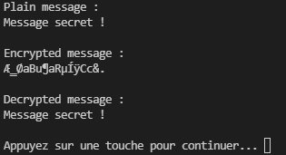

# Implémentation d'AES 128 sur un bloc de 16 octets

Chiffrement d'un message en clair : "Message secret !" (16 octets) et déchiffrement du message chiffré.



La clé de chiffrement est quelconque et définie dans le code.

```
uint8_t cipherKey[16] = { 0x2B, 0x7E, 0x15, 0x16, 0x28, 0xAE, 0xD2, 0xA6, 0xAB, 0xF7, 0x15, 0x88, 0x09, 0xCF, 0x4F, 0x3C };
```

### Notes : 
---
Les tableaux M1, M2, M3 et M4 sont des tables de pré-calculs pour l'opération "mixColumns".


